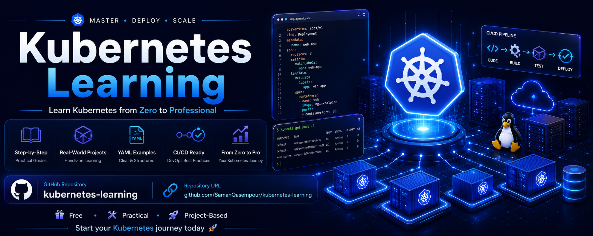

# ☸️ Kubernetes Zero to Pro

[🇬🇧 English](./README.md) | **🇮🇷 فارسی**

آموزش **Kubernetes از صفر تا حرفه‌ای** با رویکرد عملی، ساختاریافته و پروژه‌محور.

این Repository برای یادگیری Kubernetes از مفاهیم پایه تا مباحث پیشرفته و استفاده از آن در پروژه‌های واقعی **DevOps** ایجاد شده است.

---

## 🎯 هدف دوره

هدف این دوره این است که Kubernetes را فقط با حفظ کردن دستورات یاد نگیری، بلکه **معماری، مفاهیم و نحوه عملکرد آن را به‌صورت عمیق درک کنی.**

در پایان دوره می‌توانی:

* معماری Kubernetes را توضیح بدهی.
* مفاهیم اصلی Kubernetes را درک کنی.
* Applicationها را روی Kubernetes Deploy و مدیریت کنی.
* با Pod، Deployment، ReplicaSet و Service کار کنی.
* Configuration و Secretها را مدیریت کنی.
* Networking در Kubernetes را درک و مدیریت کنی.
* Storage و Persistent Storage را مدیریت کنی.
* Resourceها و Scheduling را کنترل کنی.
* Health Check و Auto Scaling را پیاده‌سازی کنی.
* مفاهیم امنیتی Kubernetes را درک کنی.
* مشکلات Kubernetes را Troubleshoot کنی.
* Kubernetes را در پروژه‌های واقعی DevOps استفاده کنی.
* Applicationها را در محیط‌های Production مدیریت کنی.

---

## 📚 ساختار دوره

دوره به چند **Chapter** تقسیم شده و هر Chapter شامل چند **Lesson** است.

هر Lesson پوشه مخصوص خودش را دارد و نسخه انگلیسی و فارسی آن در همان پوشه قرار می‌گیرد.

```text
kubernetes-zero-to-pro/
│
├── README.md
├── README.fa.md
│
├── Chapter-01/
│   │
│   ├── Lesson-01/
│   │   ├── README.md
│   │   └── README.fa.md
│   │
│   ├── Lesson-02/
│   │   ├── README.md
│   │   └── README.fa.md
│   │
│   └── ...
│
├── Chapter-02/
│   └── ...
│
└── ...
```

---

## 🗂️ فصل‌های دوره

### Chapter 01 — Kubernetes Fundamentals

آشنایی با Kubernetes، کاربرد آن، معماری، Componentهای اصلی و مفاهیم پایه.

### Chapter 02 — Kubernetes Workloads

بررسی Pod، ReplicaSet، Deployment، Job، CronJob و مدیریت Workloadها.

### Chapter 03 — Networking

بررسی Service، DNS، Networking، Ingress و ارتباط بین Workloadها.

### Chapter 04 — Configuration & Secrets

بررسی ConfigMap، Secret، Environment Variables و مدیریت Configuration.

### Chapter 05 — Storage

بررسی Volume، PersistentVolume، PersistentVolumeClaim و مدیریت Storage.

### Chapter 06 — Scheduling & Resources

بررسی Resource Requests، Limits، Scheduling، Taints، Tolerations و مدیریت Nodeها.

### Chapter 07 — Health & Scaling

بررسی Liveness Probe، Readiness Probe، Startup Probe، HPA و Scaling.

### Chapter 08 — Security

بررسی RBAC، ServiceAccount، Security Context و مفاهیم امنیتی Kubernetes.

### Chapter 09 — Troubleshooting

بررسی Logs، Events، Debugging و روش‌های عیب‌یابی Kubernetes.

### Chapter 10 — Advanced Kubernetes

بررسی مفاهیم و قابلیت‌های پیشرفته Kubernetes برای استفاده حرفه‌ای.

### Chapter 11 — Production & DevOps

بررسی Kubernetes در محیط Production، CI/CD، Monitoring، Observability و عملیات زیرساخت.

### Chapter 12 — Real-World Projects

پروژه‌های عملی برای ترکیب مفاهیم یادگرفته‌شده و تجربه کار با Kubernetes در سناریوهای واقعی.

---

## 🧪 روش یادگیری

ساختار هر Lesson به شکل زیر خواهد بود:

1. **Concept** — توضیح ساده مفهوم
2. **Technical Definition** — تعریف فنی
3. **Architecture** — بررسی نحوه عملکرد
4. **Real-World Example** — مثال واقعی
5. **Commands** — دستورات موردنیاز
6. **Hands-on Practice** — تمرین عملی
7. **Summary** — جمع‌بندی
8. **Questions** — سؤالات بررسی یادگیری

---

## 🛠️ ابزارها و تکنولوژی‌ها

در طول دوره با ابزارها و تکنولوژی‌های زیر کار خواهیم کرد:

* ☸️ Kubernetes
* 🐳 Docker
* 📦 Containerd
* 🐧 Linux
* ⌨️ kubectl
* 📄 YAML
* 🔀 Git & GitHub
* ⛵ Helm
* 📊 Prometheus
* 📈 Grafana
* 🔄 CI/CD
* ☁️ Cloud Infrastructure

---

## 📌 پیش‌نیازها

برای شروع این دوره نیازی به دانش قبلی Kubernetes نیست.

مفاهیم از پایه شروع شده و به‌صورت مرحله‌به‌مرحله وارد مباحث پیشرفته می‌شویم.

آشنایی اولیه با موارد زیر مفید است:

* Linux
* Command Line
* Docker
* Networking
* Git

مفاهیم موردنیاز نیز در صورت نیاز در طول دوره توضیح داده خواهند شد.

---

## 🚀 فلسفه دوره

هدف این دوره فقط **حفظ کردن دستورات Kubernetes** نیست.

هدف این است که واقعاً درک کنی:

> **Kubernetes چه کاری انجام می‌دهد، چرا این کار را انجام می‌دهد، چگونه کار می‌کند و چگونه باید آن را در یک زیرساخت واقعی مدیریت کرد.**

---

## 📖 Documentation

این Repository با رویکرد **Documentation First** ساخته شده است.

هر Chapter شامل چند Lesson است و هر Lesson شامل مستندات، مثال‌ها، دستورات و تمرین‌های عملی مربوط به خودش است.

تمام درس‌ها به دو زبان ارائه می‌شوند:

* 🇬🇧 English
* 🇮🇷 فارسی

---

## 👨‍💻 Author

**Saman Qasempour**

حوزه‌های تمرکز:

* DevOps
* Linux
* Kubernetes
* Cloud Infrastructure
* Automation
* Software Engineering

---

## ⭐ وضعیت پروژه

🚧 **در حال توسعه**

Chapterها، Lessonها، تمرین‌ها و پروژه‌های جدید به‌صورت تدریجی به Repository اضافه خواهند شد.

---

## 📜 License

این Repository با هدف آموزش و یادگیری Kubernetes ایجاد شده است.

---

[🇬🇧 English](./README.md) | **🇮🇷 فارسی**
